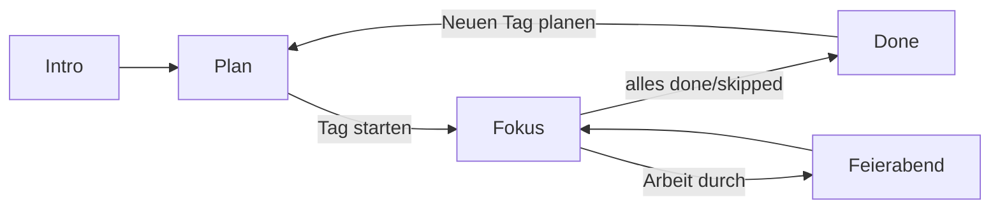

# Anker

**Eine Sache. Realistisch. Zurückfinden.**

Web-App für fokussiertes Tagesarbeiten — ADHS-freundlich: wenig planen, eine Sache nach der anderen, sanft zurückfinden. Entlasten, nicht bewerten: keine Scores, keine Streaks, keine Stimmungs-Historie.

| | |
|---|---|
| **Live** | https://anker-dun.vercel.app |
| **Repo** | https://github.com/thomaspeters0476-droid/anker |
| **One-Pager** | [`docs/anker-onepager.pdf`](docs/anker-onepager.pdf) |

---

## Haltung

- **Kapazitätsbremse** statt „alles rein“
- **Eine aktive Aufgabe** — der Rest wartet absichtlich
- **Alltag zählt** gleichwertig (Hund, Essen, Schlafen …) — Stabilität vor „Produktivität“
- **App-Buddy** als Standard (warm / kurz / klar), nicht bewertend
- **Daten lokal** im Browser — kein Account nötig

---

## Was die App tut

### Tagesablauf

1. **Plan** — Tagesgefühl, wenige Arbeitsaufgaben (S/M/L), Alltagsanker, Einstellungen
2. **Fokus** — Timer, Check-ins, Geistesblitze parken, weicher Freeze beim Verlassen
3. **Done** — Überblick Geschafft / Offen; „Neuen Tag planen“ übernimmt Offenes

Reihenfolge im Fokus: zuerst **Arbeit**, dann **Alltag**. Wenn die Arbeit durch ist → **Feierabend-Modus** (Geistesblitzspeicher frei).

### Arbeitsaufgaben & Kapazität

| Größe | Punkte | Minuten (Baseline) |
|-------|--------|--------------------|
| Klein | 1 | 15 |
| Mittel | 2 | 25 |
| Groß | 3 | 40 |

- Tagesdeckel: max. **8 Punkte**; Hard-Caps (z. B. max. 2× groß)
- Nur Arbeit zählt gegen die Punkt-Kapazität
- Einstellungen am unteren Rand des Plan-Screens

### Tagesgefühl (nur heute)

**gut / geht so / eher schwer** skaliert Kapazität, Timer-Minuten und Alltags-Maximum. Wird **nicht** historisch gespeichert.

### Alltagsanker

- Eigene Vorschläge + anpassbare Standards (Hund, Essen, Schlafen, …)
- × am Chip blendet einen Vorschlag dauerhaft aus
- Eigene Anker bleiben über Tage erhalten
- Max. einstellbar (Default 3, hart max. 5)

### Offenes mitnehmen

Unfertige / übersprungene Aufgaben landen unter **„Noch offen“** — beim nächsten Tag **oder** nach „Neuen Tag planen“. Übernehmen oder verwerfen.

### Geistesblitze

- Kurz **notiz / skizze / audio** parken, dann zurück zur Aufgabe
- Speicher erst frei, wenn **Arbeitsaufgaben** erledigt/übersprungen sind (Alltag sperrt nicht)
- Bleiben max. **7 Tage**, dann weg — kein Archiv-Druck
- Export: Kopieren, Text, PDF, Audio

### Weicher Freeze

Beim Verlassen der App pausiert der Timer (Zeit läuft weiter, kein Reset). Optionale sanfte Mitteilungen („zurückkommen“) — ausstellbar / einstellbar unter Freeze.

### PWA & Erinnerungen

Als Web-App installierbar (iPhone/Android-Anleitung in der App). Browser-Erinnerungen für Check-in, Away-Nudges, Feierabend, Schlaf-Anker (Berechtigung nötig).

### Einführung

Vier kurze Schritte beim ersten Start; erneut über „Einführung anzeigen“ auf dem Plan (Button in Einstellungen versteckbar).

---

## Tech-Stack

- **Vite 8** + **React 19** + **TypeScript**
- **vite-plugin-pwa** (Service Worker, Manifest, autoUpdate)
- **jspdf** — PDF-Export (Geistesblitze / One-Pager-Skript)
- **oxlint** — Lint
- Hosting: **Vercel** (`vercel.json` für SW/Manifest-Header)
- Kein Backend — alles `localStorage`

---

## Projektstruktur

```
src/
  App.tsx              # Screen-Routing (plan | focus | done), Persistenz
  types.ts             # DayState, Tasks, Life-Templates, Helpers
  storage.ts           # localStorage, Carry-over, Sparks-Vault, Prefs
  capacity.ts          # Größen, Punkte, Caps
  mood.ts              # Tagesgefühl-Skalierung
  buddy.ts             # Buddy-Texte (warm / kurz / klar)
  softFreeze.ts        # Defaults Away-Nudges
  notifications.ts     # Browser-Notifications
  exportSparks.ts      # Text / PDF / Audio-Export
  pwa.ts               # Install-Helpers
  screens/
    PlanScreen.tsx     # Planen, Mood, Carry, Alltag, Settings
    FocusScreen.tsx    # Timer, Check-ins, Freeze, Sparks, Feierabend
    DoneScreen.tsx     # Abschluss, Neuen Tag planen
  components/
    Intro.tsx
    PwaGuide.tsx
    SparkCapture.tsx
    SparkVault.tsx
docs/
  anker-onepager.html / .pdf
scripts/
  generate-onepager.mjs
```

---

## Daten (localStorage)

| Key | Inhalt |
|-----|--------|
| `fokus-buddy-day` | Aktueller Tageszustand (`DayState`) |
| `anker-prefs` | Dauerhafte Einstellungen (Kapazität-Baseline, Buddy, lifeMax, Freeze, Life-Anker, …) |
| `anker-carry` | Offene Aufgaben zum Mitnehmen |
| `anker-sparks` | Geistesblitz-Vault (≤ 7 Tage) |
| `anker-intro-seen` | Intro erledigt |

Jedes Speichern des Tags schreibt Day + Vault + Prefs (`saveDay`). Stimmung nur im Day, nicht in Prefs.

---

## Lokal entwickeln

```bash
npm install
npm run dev      # Dev-Server
npm run build    # tsc + Vite → dist/
npm run preview  # Build lokal ansehen
npm run lint     # oxlint
```

One-Pager neu erzeugen (Chrome oder Edge nötig):

```bash
node scripts/generate-onepager.mjs
```

---

## Produktfluss (kurz)



---

## Bewusst noch nicht

- Kein Login / Cloud-Sync (Gerät = Datenort)
- Kein Store-Build (Capacitor o. Ä. später möglich)
- Keine KI-Buddy-Backend — Texte lokal in `buddy.ts`

---

## Lizenz / Status

Privates MVP in aktiver Entwicklung. Stand der Doku: Carry-over-Fix, anpassbare Alltagsanker, Soft Freeze, Mood, PWA, One-Pager.
