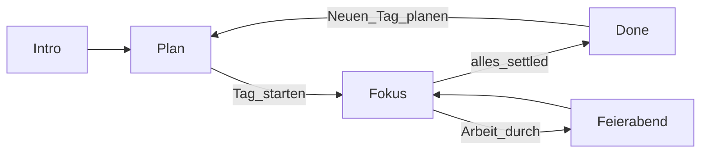

# Tagesanker — Architektur

**Stack:** Vite 8 · React 19 · TypeScript · vite-plugin-pwa · jsPDF · optional Supabase (Sync)  
**Persistenz:** `localStorage` lokal; optional Cloud-Sync nach OTP-Anmeldung, **Ende-zu-Ende verschlüsselt** (Envelope + verschlüsselte Spark-Blobs in Storage). Ohne Sync: unverändert local-first, kein Login-Gate.

Produktkontext: [ANKER_KONZEPT.md](./ANKER_KONZEPT.md) · Daten: [DATENMODELL.md](./DATENMODELL.md)

---

## Screen-Flow

Routing ohne React-Router in [`src/App.tsx`](../src/App.tsx):



| Screen | Bedingung | Datei |
|--------|-----------|--------|
| Intro | `!anker-intro-seen` bzw. manuell | `components/Intro.tsx` |
| plan | Default / nicht gestartet | `screens/PlanScreen.tsx` |
| focus | `day.started` | `screens/FocusScreen.tsx` |
| done | gestartet und alle Tasks `done`/`skipped` | `screens/DoneScreen.tsx` |

Jeder `day`-State-Change → `saveDay(day)` (Effect in `App.tsx`).

---

## Modulübersicht

```
src/
  App.tsx              Screen-Wahl, Persistenz-Hook
  types.ts             DayState, Task, Life-Helpers
  storage.ts           localStorage, Carry, Vault, Prefs, rollDayForward, Sync-Snapshot
  sync/                optional Supabase Magic Link + pull/push (Last-Write-Wins)
  capacity.ts          Punkte, Minuten, Caps
  mood.ts              Tagesgefühl-Skalierung
  buddy.ts             Buddy-Texte + BuddyCtx
  softFreeze.ts        Defaults Away-Nudges
  notifications.ts     Browser Notifications
  exportSparks.ts      Text / PDF / Audio
  pwa.ts               Standalone / Install-Helpers
  screens/             Plan, Fokus, Done
  components/          Intro, PwaGuide, SparkCapture, SparkVault, Handbook, RegulateDown
```

---

## Domänenregeln (kurz)

| Regel | Ort |
|-------|-----|
| Nächste Aufgabe: erst Arbeit, dann Alltag | `activateNext` in `FocusScreen.tsx` |
| Vault offen nur wenn Arbeit settled | `workTasksSettled` in `types.ts` |
| Tag rollen + Carry | `rollDayForward` in `storage.ts` |
| Mood skaliert Baseline, nicht Prefs-Historie | `mood.ts` + PlanScreen |
| Soft Freeze bei `visibilitychange` | `FocusScreen.tsx` |

---

## Sync (optional)

- Eigenes Supabase-Projekt nur für Tagesanker — siehe [`supabase/README.md`](../supabase/README.md)
- App ohne Login unverändert nutzbar
- Nach Magic Link: Snapshot (`day`, `prefs`, `carry`, `sparks`) in `user_state`, RLS pro User
- Konflikt: Last-Write-Wins über `updated_at`; bei Gleichstand und abweichendem Inhalt Dialog in den Einstellungen

---

## UI / Geräte (Sync)

Die App (`/app`) ist **ein Fokus-Strom**, nicht ein Desktop-Dashboard. Farben, Typo und Atmosphäre bleiben auf allen Geräten gleich.

| Breite | Shell (max) | Haltung |
|--------|-------------|---------|
| Phone | 560px | Default |
| Tablet (~720+) | 680px | Mehr Padding/Luft, Overlays zentriert |
| Desktop (~960+) | 780–820px | Lesbarer, Maus-Hover; weiterhin eine Spalte |

CSS-Variablen: `--app-shell-max`, `--app-pad-*`, `--app-gap` in [`src/index.css`](../src/index.css); Feintuning in [`src/App.css`](../src/App.css).

---

## PWA

- Plugin: `vite-plugin-pwa` in [`vite.config.ts`](../vite.config.ts)
- Manifest DE, theme `#2f6f5e`, `display: standalone`
- `registerType: 'autoUpdate'`
- Header für SW/Manifest: [`vercel.json`](../vercel.json)

---

## Erweiterungen (geplant)

Verkauf/Checkout und Store-Wrapper: [ANKER_ROADMAP.md](./ANKER_ROADMAP.md).
