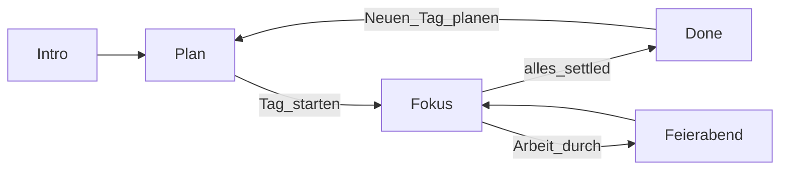

# Anker — Architektur

**Stack:** Vite 8 · React 19 · TypeScript · vite-plugin-pwa · jsPDF  
**Kein Backend** in der Testphase — Persistenz über `localStorage`.

Produktkontext: [ANKER_KONZEPT.md](./ANKER_KONZEPT.md) · Daten: [DATENMODELL.md](./DATENMODELL.md)

---

## Screen-Flow

Routing ohne React-Router in [`src/App.tsx`](../src/App.tsx):



| Screen | Bedingung | Datei |
|--------|-----------|--------|
| Intro | `!anker-intro-seen` bzw. manuell | `components/Intro.tsx` |
| plan | Default / nicht gestartet | `screens/PlanScreen.tsx` |
| focus | `day.started` | `screens/FocusScreen.tsx` |
| done | gestartet und alle Tasks `done`/`skipped` | `screens/DoneScreen.tsx` |

Jeder `day`-State-Change → `saveDay(day)` (Effect in `App.tsx`).

---

## Modulübersicht

```
src/
  App.tsx              Screen-Wahl, Persistenz-Hook
  types.ts             DayState, Task, Life-Helpers
  storage.ts           localStorage, Carry, Vault, Prefs, rollDayForward
  capacity.ts          Punkte, Minuten, Caps
  mood.ts              Tagesgefühl-Skalierung
  buddy.ts             Buddy-Texte + BuddyCtx
  softFreeze.ts        Defaults Away-Nudges
  notifications.ts     Browser Notifications
  exportSparks.ts      Text / PDF / Audio
  pwa.ts               Standalone / Install-Helpers
  screens/             Plan, Fokus, Done
  components/          Intro, PwaGuide, SparkCapture, SparkVault, Handbook, RegulateDown
```

---

## Domänenregeln (kurz)

| Regel | Ort |
|-------|-----|
| Nächste Aufgabe: erst Arbeit, dann Alltag | `activateNext` in `FocusScreen.tsx` |
| Vault offen nur wenn Arbeit settled | `workTasksSettled` in `types.ts` |
| Tag rollen + Carry | `rollDayForward` in `storage.ts` |
| Mood skaliert Baseline, nicht Prefs-Historie | `mood.ts` + PlanScreen |
| Soft Freeze bei `visibilitychange` | `FocusScreen.tsx` |

---

## PWA

- Plugin: `vite-plugin-pwa` in [`vite.config.ts`](../vite.config.ts)
- Manifest DE, theme `#2f6f5e`, `display: standalone`
- `registerType: 'autoUpdate'`
- Header für SW/Manifest: [`vercel.json`](../vercel.json)

---

## Erweiterungen (geplant)

Sync/Account werden voraussichtlich eine API-Schicht + Auth brauchen; UI-Screens bleiben, Persistenz wandert teilweise von rein lokal zu „lokal + remote“. Siehe [ANKER_ROADMAP.md](./ANKER_ROADMAP.md).
